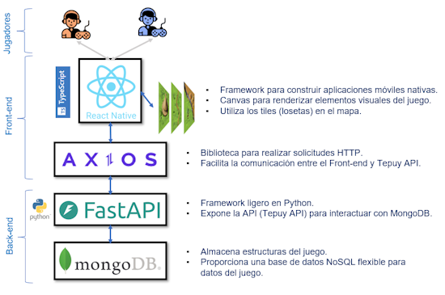

# Tepuy: prototipo de un video juego

Tepuy es un prototipo de videojuego basado en [Carcassonne](https://en.wikipedia.org/wiki/Carcassonne_(board_game))



El código esta dividido en: <br/><br/>
**Backend**<br/>
**Frontend**<br/>

## **Pasos para instalar y ejecutar la aplicación**

### **1. Clonar el repositorio**
Clona el repositorio en tu máquina local:

```
git clone https://github.com/ruthbri/tepuy.git
cd tepuy
```

### **2. Inicia los contenedores con MongoDB y FastAPI**

```
cd backend
docker-compose up --build
```
Con esto crearas y ejecutas los contenedores para la API y la base de datos MongoDB

### **3. Restaurar los datos en la base de datos**

```
docker cp dump.archive mongodb_tepuy:/data/dump.archive
docker exec -i mongodb_tepuy mongorestore --archive=/data/dump.archive
cd ..
```

### **4. Si quieres verificar que todo te salio bien**

Usando el navegador, visita esta URL: [http://localhost:8000](http://localhost:8000) <br/>
Deberias ver este mensaje: {"message":"Welcome to the FastAPI Game API"}

Comprueba los endpoints de la API: [http://localhost:8000/docs](http://localhost:8000/docs)

### **5. Ejecutar la applicación**

La aplicación se ha creado usando [Expo](https://expo.dev/). Necesitas tener instalado: <br/>
**node.js**: [https://nodejs.org/en/download](https://nodejs.org/en/download) <br/>
**npm**: Se instala junto con node.js

Instalar las dependencias:
```
cd frontend
npm install
```

Arrancar la aplicación:
```
npx expo start
```
